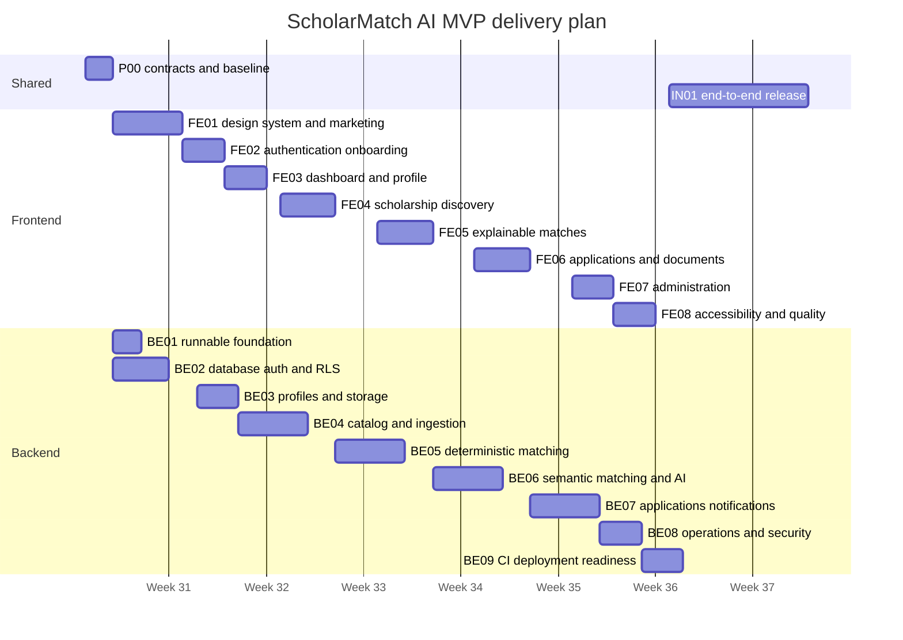

# ScholarMatch AI: Development Prompts and Delivery Timeline

## 1. How to use this document

This is an execution playbook for building the ScholarMatch AI MVP with an AI coding agent or a human engineering team. Each prompt is intentionally scoped to one reviewable unit of work and includes its own dependencies, estimate, deliverables, checks, and definition of done.

Run prompts in dependency order. Frontend and backend prompts may run in parallel where the timeline permits, but do not start a prompt until its listed dependencies are complete. Use one branch and pull request per prompt unless two adjacent prompts are explicitly combined.

### Delivery assumptions

- Team: one frontend engineer, one backend engineer, and shared product/design/QA support.
- Estimates are focused engineering days and include implementation, automated tests, self-review, and one ordinary review cycle.
- The plan targets a production-capable MVP in **eight calendar weeks**. A single full-stack engineer should expect roughly **12–14 weeks**.
- Scholarship data providers, final brand assets, email provider, hosting vendor, and the production embedding model must be confirmed before the prompts that depend on them.
- The existing architecture direction in `docs/TECH_STACK_AND_ARCHITECTURE.md` is the source of truth unless an accepted architecture decision record changes it.

## 2. Frontend reference direction

The ScholarMatch marketing experience should be a faithful adaptation of the visual language and page rhythm observed on [Wispr Flow](https://wisprflow.ai/) on 28 July 2026. It should feel recognizably inspired by that reference while remaining an original ScholarMatch product.

### Design characteristics to reproduce

| Reference characteristic                         | ScholarMatch adaptation                                                                                                         |
| ------------------------------------------------ | ------------------------------------------------------------------------------------------------------------------------------- |
| Warm ivory canvas                                | Use `#FFFFEB` as the primary marketing background.                                                                              |
| Near-black editorial sections                    | Use `#1A1A1A` for high-contrast story and product-demo sections.                                                                |
| Lavender primary CTA                             | Use `#F0D7FF` with an ink border and high-contrast text.                                                                        |
| Oversized editorial serif headings               | Use EB Garamond for display copy, including approximately 120px/0.85 line-height on large screens and fluid responsive scaling. |
| Clean sans-serif utility copy                    | Use Figtree for navigation, body text, labels, controls, and the authenticated product.                                         |
| Floating, bordered navigation                    | Create an inset sticky header with a subtle border, 12px radius, compact menu, and prominent CTA.                               |
| Alternating light and dark storytelling sections | Translate the rhythm into scholarship discovery, matching, deadline, and application stories.                                   |
| Large rounded product demonstrations             | Build original ScholarMatch interface mockups or live components; never reuse Wispr media.                                      |
| Marquees and horizontal proof bands              | Use verified scholarship categories, study destinations, or partner logos only when permission and evidence exist.              |
| Tabbed audience/use-case section                 | Use Undergraduate, Postgraduate, International, STEM, Research, and Community categories.                                       |
| Large testimonial carousel and case-study cards  | Use real approved ScholarMatch research or clearly labeled placeholders; do not invent endorsements.                            |
| Restrained but expressive motion                 | Use reveal, marquee, tab, and carousel motion with a complete reduced-motion fallback.                                          |

### Originality and content rules

- Do not copy the Wispr Flow name, logo, wording, testimonials, screenshots, illustrations, source code, or downloadable assets.
- Do not imply that Wispr endorses or is affiliated with ScholarMatch.
- Preserve the composition, typographic contrast, spacing rhythm, color relationships, border treatment, and interaction quality while writing original scholarship-focused copy.
- Do not publish fabricated scholarship counts, acceptance rates, university logos, testimonials, or outcome claims. Use verified data or clearly marked development placeholders.
- All product UI shown in marketing sections must correspond to a real planned or implemented ScholarMatch workflow.

### Proposed landing-page narrative

1. **Hero:** “Don’t hunt, just match.” Explain that a student profile becomes ranked, explainable scholarship opportunities. Primary CTA: “Find my scholarships.” Secondary CTA: “See how matching works.”
2. **Product demonstration:** Show profile facts flowing through eligibility checks into a ranked match card.
3. **Trust/category band:** Display verified scholarship categories or approved partners; otherwise use non-claim labels such as STEM, Postgraduate, Research, Leadership, and International Study.
4. **Outcome section:** “One profile. Better matches.” Demonstrate reduced search effort without publishing an unverified numerical claim.
5. **Use-case tabs:** Show how recommendations adapt for different study levels and goals.
6. **Feature story:** Eligibility-first matching, understandable score breakdowns, deadline tracking, and document readiness.
7. **Student stories:** Use approved interviews or intentionally labeled sample content in non-production environments.
8. **Closing CTA:** “Your next opportunity could already fit.” Invite the student to create a profile.
9. **Footer:** Product, Resources, Company, Legal, privacy controls, and contact routes.

## 3. Eight-week delivery timeline



The dates illustrate an eight-week run beginning Monday, 3 August 2026. Shift the dates as a block if development begins later; preserve the dependencies and duration buffers.

### Prompt-by-prompt schedule

| ID   | Development window |        Estimate | Owner     | Outcome                                                                               |
| ---- | ------------------ | --------------: | --------- | ------------------------------------------------------------------------------------- |
| P00  | Week 1             |   2 days shared | Full team | Runnable baseline, contracts, decision log, and quality gates.                        |
| FE01 | Weeks 1–2          |          5 days | Frontend  | Original ScholarMatch landing page faithfully adapting the reference design language. |
| FE02 | Week 2             |          3 days | Frontend  | Authentication and accessible student onboarding.                                     |
| FE03 | Week 2             |          3 days | Frontend  | Authenticated shell, dashboard, and profile editing.                                  |
| FE04 | Week 3             |          4 days | Frontend  | Scholarship search, filters, cards, and detail pages.                                 |
| FE05 | Week 4             |          4 days | Frontend  | Ranked matches with eligibility, score, gaps, and explanation UI.                     |
| FE06 | Week 5             |          4 days | Frontend  | Saved items, application tracking, documents, and deadlines.                          |
| FE07 | Week 6             |          3 days | Frontend  | Role-protected scholarship and ingestion administration.                              |
| FE08 | Weeks 6–7          |          3 days | Frontend  | Accessibility, responsive QA, performance, analytics, and UI tests.                   |
| BE01 | Week 1             |          2 days | Backend   | Correct, runnable FastAPI foundation.                                                 |
| BE02 | Weeks 1–2          |          4 days | Backend   | Migrations, JWT validation, authorization, and RLS.                                   |
| BE03 | Week 2             |          3 days | Backend   | Profile and private document services.                                                |
| BE04 | Weeks 2–3          |          5 days | Backend   | Scholarship catalog and idempotent ingestion pipeline.                                |
| BE05 | Weeks 3–4          |          5 days | Backend   | Deterministic, reproducible eligibility and scoring engine.                           |
| BE06 | Weeks 4–5          |          5 days | Backend   | pgvector retrieval and grounded Qwen explanations.                                    |
| BE07 | Weeks 5–6          |          5 days | Backend   | Application workflow, jobs, and deadline notifications.                               |
| BE08 | Week 6             |          3 days | Backend   | Admin controls, monitoring, privacy, and operational hardening.                       |
| BE09 | Week 7             |          3 days | Backend   | CI, containerization, deployment, backup, and runbooks.                               |
| IN01 | Weeks 7–8          | 10 elapsed days | Full team | Contract integration, complete journeys, security review, QA, and staged release.     |

## 4. Prompt P00 — Establish the product contract and engineering baseline

**Estimate:** 2 shared engineering days  
**Dependencies:** None  
**Target:** Week 1

```text
You are establishing the implementation baseline for ScholarMatch AI.

Repository: scholarmatch-ai
Architecture source: docs/TECH_STACK_AND_ARCHITECTURE.md

Before editing:
1. Inspect the entire repository and current Git status.
2. Preserve all user changes and secrets. Never print values from .env files.
3. Read every applicable AGENTS.md. The frontend uses Next.js 16, so inspect the bundled Next.js documentation identified by frontend/AGENTS.md before changing framework code.

Implement only the shared baseline:
- Write a concise root README with product purpose, repository layout, prerequisites, local startup, environment-variable names, test commands, and links to both architecture documents.
- Add an architecture decision log directory and initial decisions for modular monolith, Supabase/PostgreSQL, pgvector, Qwen behind an adapter, and Redis-backed workers.
- Define the initial /api/v1 resource contract in a checked-in OpenAPI document or a generated-schema workflow. Cover profile, scholarships, matches, applications, document upload, and admin ingestion.
- Standardize error envelopes, pagination fields, ISO-8601 timestamps, UUID identifiers, and idempotency-key behavior.
- Add formatting, lint, type-check, test, and build commands for both frontend and backend without rewriting functional features.
- Add a sanitized root environment example or document the existing split examples. Do not commit credentials.
- Record unresolved product decisions in docs/OPEN_QUESTIONS.md with an owner and decision deadline.

Acceptance criteria:
- A new contributor can start both services using only checked-in instructions and their own environment values.
- Frontend and backend agree on request, response, auth, pagination, and error shapes.
- Quality commands are deterministic and suitable for CI.
- No secret appears in Git diff, logs, examples, or tests.
- Run all available checks and report exact results and remaining scaffold failures.

Do not implement domain features in this prompt. Do not commit or push unless explicitly asked.
```

## 5. Frontend prompts

### FE01 — Build the design system and reference-inspired marketing homepage

**Estimate:** 5 frontend days  
**Dependencies:** P00  
**Target:** Weeks 1–2

```text
Implement the ScholarMatch AI marketing homepage and its reusable visual system in frontend/.

Design goal:
Create an original ScholarMatch experience that faithfully adapts the visual language and page rhythm of https://wisprflow.ai/ as observed on 28 July 2026. Reproduce the warm ivory canvas, ink editorial panels, lavender bordered CTA, inset sticky navigation, oversized serif display typography, clean sans-serif utility typography, alternating story sections, rounded product demonstrations, horizontal proof bands, tabbed use cases, testimonial motion, and large closing CTA.

Brand constraints:
- Use ScholarMatch names, copy, interface mockups, icons, and assets only.
- Do not copy Wispr's logo, text, testimonials, screenshots, illustrations, code, or proprietary assets.
- Do not invent partners, student outcomes, scholarship volume, acceptance rates, or testimonials.
- Use clearly labeled placeholders only in development data and keep them out of production builds.

Required visual tokens:
- Marketing canvas: #FFFFEB.
- Primary ink: #1A1A1A.
- Primary accent: #F0D7FF with ink text and an approximately 2px ink border.
- Display font: EB Garamond through next/font.
- Body/UI font: Figtree through next/font.
- Desktop display headings should reach approximately 120px with a tight line height; use fluid clamp() sizing down to mobile.
- Use approximately 12px control/header radii and much larger radii for demonstration frames.

Build these sections:
1. Inset sticky navigation with ScholarMatch wordmark, Product, For Students, Resources, About, Sign in, and “Find scholarships” CTA. Provide an accessible mobile menu.
2. Hero with “Don’t hunt, just match,” supporting copy, two CTAs, and an original animated matching demonstration.
3. Dark product-demonstration section showing profile facts moving through eligibility checks into ranked matches.
4. Proof/category marquee using non-claim labels unless verified partner data exists.
5. Light editorial outcome section titled “One profile. Better matches.” with an original comparison visual.
6. Dark tabbed use-case section for Undergraduate, Postgraduate, International, STEM, Research, and Community.
7. Feature storytelling for eligibility-first matching, explainable scoring, deadline tracking, and document readiness.
8. Student-story carousel that consumes approved content; show an honest empty or sample state when content is unavailable.
9. Closing CTA: “Your next opportunity could already fit.”
10. Complete footer with product, resources, company, legal, accessibility, and privacy links.

Implementation requirements:
- Use Server Components by default and Client Components only for actual interaction.
- Create reusable primitives and design tokens rather than a single oversized page component.
- Use semantic landmarks and heading order, keyboard-operable navigation/tabs/carousel, visible focus, and WCAG AA contrast.
- Use Framer Motion for component transitions. Use GSAP only if a sequence cannot be expressed cleanly with CSS or Framer Motion.
- Respect prefers-reduced-motion: remove marquees, parallax, and autoplay while keeping all content available.
- Avoid layout shift, large unoptimized media, autoplay audio, scroll hijacking, and cursor replacement.
- Render original interface demonstrations using HTML/CSS where possible so they are responsive and accessible.
- Add metadata, Open Graph placeholders owned by ScholarMatch, canonical URL configuration, and structured organization/software data only when factually valid.

Validation:
- Verify at 320, 375, 768, 1024, 1280, and 1440px widths.
- Run lint, type-check, tests, and production build.
- Confirm no horizontal overflow, clipped headline, inaccessible hidden content, hydration warning, or console error.
- Add component tests for navigation, tabs, carousel controls, and reduced-motion behavior.
- Compare the final page rhythm and styling against the reference, then document deliberate differences.

Definition of done:
The homepage feels like a faithful ScholarMatch-specific interpretation of the reference at first glance, but every brand element, claim, asset, and product demonstration is original and truthful.
```

### FE02 — Implement authentication and student onboarding

**Estimate:** 3 frontend days  
**Dependencies:** P00, BE02 auth contract available  
**Target:** Week 2

```text
Implement authentication and student onboarding in frontend/ using the agreed Supabase Auth and /api/v1 contracts.

Scope:
- Sign up, sign in, sign out, email verification, forgot password, reset password, and session-expired states.
- A resumable multi-step onboarding flow for identity, location/nationality, education level, field of study, academic results, goals/interests, experience, and optional accessibility/preferences.
- Clear consent and privacy copy before collecting sensitive profile data.
- Progress saved after every completed step; users can safely resume on another device.
- Unknown and “prefer not to say” must remain distinct from a negative answer.

UX direction:
- Carry the ivory/ink/lavender identity into auth screens while prioritizing form clarity over marketing motion.
- Use one question group per step, plain-language help, inline validation, a visible progress indicator, Back/Continue controls, and a review screen.
- Explain why potentially sensitive fields improve eligibility checks and whether they are optional.

Engineering requirements:
- Keep the Supabase service-role key out of the browser.
- Use secure session handling appropriate to the selected Next.js/Supabase integration.
- Generate or consume typed API contracts; do not duplicate response types by hand if generation exists.
- Handle loading, offline, expired-token, API-validation, duplicate-account, and rate-limit states.
- Prevent double submission and preserve typed input when a recoverable request fails.

Acceptance criteria:
- Keyboard-only and screen-reader users can complete every flow.
- Refresh and back/forward navigation do not corrupt onboarding progress.
- Authentication redirects preserve the intended destination safely.
- Unit/component tests cover validation, resume, error, and successful completion paths.
- Lint, type-check, tests, and production build pass.

Do not add social-login providers that have not been configured and approved.
```

### FE03 — Build the authenticated dashboard and profile experience

**Estimate:** 3 frontend days  
**Dependencies:** FE02, BE03  
**Target:** Week 2

```text
Build the authenticated ScholarMatch application shell, dashboard, and profile editor.

Required experience:
- Responsive app navigation for Dashboard, Matches, Scholarships, Applications, Documents, Profile, and Settings.
- Dashboard greeting with profile completeness, urgent deadlines, new/updated matches, application progress, and one clear next action.
- Profile summary grouped by matching-relevant facts, with edit flows and data-freshness timestamps.
- Honest empty, loading, partial-data, error, and first-use states.
- A compact explanation of how profile completeness affects match confidence without implying guaranteed eligibility.

Design:
- Retain Figtree, ink, ivory, and lavender but use a denser product UI than the marketing site.
- Reuse border language and generous rounded surfaces without turning every block into a card.
- Use the serif display font only for page-level editorial moments, not tables, controls, or dense data.

Engineering:
- Use Server Components for initial data where appropriate and scoped client components for editing.
- Protect authenticated routes on the server and avoid flashes of private content.
- Add reusable query/error/empty-state patterns and optimistic updates only where rollback is unambiguous.
- Keep user-specific responses uncached across users.

Acceptance criteria:
- Dashboard prioritization matches real deadlines and API state.
- Profile edits round-trip through the API and refresh derived completeness.
- Responsive layout works from 320px through large desktop.
- Component tests cover role protection, empty states, error recovery, and profile updates.
- Accessibility, lint, type-check, tests, and build pass.
```

### FE04 — Build scholarship discovery and detail pages

**Estimate:** 4 frontend days  
**Dependencies:** FE03, BE04 catalog endpoints  
**Target:** Week 3

```text
Implement scholarship discovery and detail experiences using the versioned API.

Discovery requirements:
- Search by title, provider, field, and normalized description.
- Filters for study level, field, destination, nationality/residency compatibility, funding type, deadline window, and verified status.
- Sort by relevance, deadline, recently verified, and funding amount where values are comparable.
- URL-synchronized filters that can be shared and restored.
- Cursor pagination or accessible “Load more”; do not build fake client-side pagination over partial data.
- Scholarship cards showing title, provider, deadline, funding summary, eligibility signal, verification date, and saved state.

Detail requirements:
- Source link, provider, funding, deadline, requirements, required documents, verified date, and provenance.
- Clear distinction among eligible, potentially eligible, ineligible, and unknown due to missing data.
- Save, start application, and report inaccurate information actions.
- Related scholarships based on real API results.

Quality:
- Keep filters keyboard accessible and usable on mobile without trapping focus.
- Avoid color-only eligibility signals.
- Format dates, currencies, and time zones consistently.
- Do not hide source provenance or make an expired scholarship appear actionable.
- Test filter serialization, pagination, save state, deadline rendering, and all eligibility states.
- Run lint, type-check, tests, and production build.
```

### FE05 — Build explainable match results

**Estimate:** 4 frontend days  
**Dependencies:** FE04, BE05, BE06  
**Target:** Week 4

```text
Implement ranked scholarship matches and the match-detail explanation experience.

Required UI:
- Ranked match list with total score, confidence, eligibility state, deadline, last calculation time, and algorithm version metadata in a non-intrusive details area.
- Score breakdown for academics, eligibility fit, interests/goals, experience, and readiness/timing.
- Plain-language “Why this matches,” “What may block you,” “Missing information,” and “Next actions.”
- A deterministic fallback when an AI explanation is pending or unavailable.
- Recalculate action with idempotent pending state, rate-limit feedback, and last-updated status.
- Feedback controls for useful/not useful and a structured reason, without claiming that feedback instantly retrains the model.

Trust requirements:
- Never present a score as a probability of winning.
- Clearly distinguish verified hard requirements from inferred relevance.
- Show unknown profile facts as questions to resolve.
- Link each important requirement to its scholarship source or provenance when provided.
- A failed Qwen explanation must not hide a valid deterministic match.

Interaction and tests:
- Use restrained animation for rank changes and score disclosure, with a reduced-motion alternative.
- Announce recalculation completion accessibly without moving focus unexpectedly.
- Test score labels, unknown/ineligible states, fallback explanation, stale calculation, feedback, and errors.
- Run accessibility checks, lint, type-check, tests, and production build.
```

### FE06 — Implement applications, documents, and deadlines

**Estimate:** 4 frontend days  
**Dependencies:** FE05, BE07  
**Target:** Week 5

```text
Implement the application workspace, private document manager, and deadline experience.

Scope:
- Saved, preparing, ready, submitted, interview, awarded, unsuccessful, and withdrawn application states using transitions allowed by the API.
- Kanban-style overview plus an accessible list/table alternative; neither view may contain functionality unavailable in the other.
- Per-application checklist, notes, source link, deadline, reminder controls, and immutable status history.
- Private document upload for approved types and sizes, upload progress, scan/processing status, rename, replace, download through signed URL, and delete confirmation.
- Document readiness indicators that map required scholarship documents to available user documents without automatically sharing files externally.
- Calendar-friendly deadline list and timezone-aware date display.

Security and UX:
- Never put service-role credentials or permanent object URLs in the client.
- Validate on the client for fast feedback but treat backend validation as authoritative.
- Confirm destructive deletion and explain downstream effects.
- Prevent duplicate status changes and uploads after retries.
- Do not send applications to scholarship providers; tracking is internal unless a future integration is explicitly approved.

Testing:
- Cover allowed/blocked state transitions, expired signed URLs, upload failures, duplicate submission, destructive confirmation, mobile layout, and keyboard use.
- Run lint, type-check, tests, and production build.
```

### FE07 — Build role-protected administration

**Estimate:** 3 frontend days  
**Dependencies:** FE06, BE04, BE08  
**Target:** Week 6

```text
Build a role-protected administration area for scholarship data quality and ingestion operations.

Required workflows:
- Scholarship create, review, edit, publish, unpublish, expire, and archive.
- Structured requirement editor for hard/soft constraint, field, operator, value, source evidence, and reviewer notes.
- Ingestion-run list and detail with source, status, created/updated/duplicate/rejected counts, safe error summaries, retry action, and timestamps.
- Duplicate-resolution workflow that preserves source history.
- Verification queue showing freshness and changed source fields.
- Append-only audit history for administrative actions.

Guardrails:
- Hide navigation from ordinary users and enforce authorization on every route and mutation; hidden UI is not security.
- Confirm publish, archive, merge, and retry actions with exact target names.
- Never render secret values, raw tokens, or unsafe imported HTML.
- Sanitize and constrain external source links.

Acceptance criteria:
- All role and forbidden states are covered.
- Bulk actions are bounded, previewed, and recoverable where practical.
- Tables work responsively and remain keyboard navigable.
- Tests cover authorization, validation, duplicate handling, publication, retry, and error states.
- Lint, type-check, tests, and build pass.
```

### FE08 — Complete accessibility, performance, analytics, and UI quality

**Estimate:** 3 frontend days  
**Dependencies:** FE01–FE07  
**Target:** Weeks 6–7

```text
Perform a release-quality frontend hardening pass across marketing and authenticated ScholarMatch experiences.

Accessibility:
- Audit landmarks, heading order, labels, descriptions, errors, focus order, dialogs, menus, tabs, carousels, live regions, and contrast against WCAG 2.2 AA.
- Test keyboard-only workflows and representative screen-reader output.
- Verify 200% zoom, reduced motion, high contrast, and touch targets.

Performance:
- Measure production builds and representative routes.
- Remove avoidable client components and JavaScript, optimize fonts/media, prevent layout shift, and lazy-load below-the-fold motion.
- Set and enforce route budgets for Core Web Vitals and bundle size; document measured baselines rather than inventing scores.

Reliability and analytics:
- Add safe error boundaries, not-found states, offline/retry behavior, and observability hooks.
- Implement privacy-respecting analytics only for agreed events. Never include profile answers, document names/content, query text containing sensitive data, tokens, or AI explanations.
- Add end-to-end tests for sign-up/onboarding, profile completion, discovery, match review, save/application, upload, and admin authorization.

Reference fidelity review:
- Compare the marketing page to the recorded Wispr-inspired design brief: palette, typography contrast, navigation treatment, section rhythm, demonstration scale, interaction quality, and closing CTA.
- Preserve original ScholarMatch content and assets while correcting unintended visual drift.

Deliver a short QA report listing viewport/browser coverage, accessibility findings, performance measurements, test results, accepted exceptions, and follow-up owners.
```

## 5.1 Frontend experience enhancement prompts

Use the prompts below after FE01 when the first marketing-page implementation exists but still feels static, sparse, or incomplete. Run them in order. Each prompt must preserve truthful ScholarMatch content and adapt only the reference site's design language—not its copy, identity, screenshots, source code, or assets.

### FE09 — Turn the marketing navigation into a complete interaction system

**Estimate:** 1–2 frontend days
**Dependencies:** FE01
**Target:** Marketing refinement

```text
Upgrade the ScholarMatch marketing navigation from a row of decorative links into a fully functional, accessible navigation system.

Inspect first:
- Read frontend/AGENTS.md and the relevant bundled Next.js 16 documentation before editing framework code.
- Review the existing routes, marketing sections, authentication routes, route guards, and current navigation tests.
- Check every current href. Do not leave links pointing to "#", nonexistent pages, or inert buttons.

Desktop navigation:
- Keep the inset floating ivory header, fine ink border, compact height, and lavender primary CTA inspired by the supplied Wispr Flow references.
- Add real Product, For Students, Resources, and About menus. Each trigger must open a purposeful mega-menu or compact dropdown containing a short description and valid destination for every item.
- Product: How matching works, Explainable matches, Eligibility checks, Deadline tracking, and Document readiness.
- For Students: Undergraduate, Postgraduate, International, STEM, Research, and Community opportunities.
- Resources: Scholarship guide, Application checklist, Eligibility glossary, FAQ, and Contact/support.
- About: Mission, How data is verified, Privacy approach, Accessibility, and Contact.
- Make Sign in navigate to /sign-in and Find scholarships navigate to the correct onboarding or authenticated discovery route according to session state.
- Add an active-route indicator and ensure logo activation returns to the homepage.
- Support click, Enter, Space, Escape, outside-click dismissal, focus return, and sensible pointer hover behavior. Do not make hover the only way to open a menu.

Mobile navigation:
- Replace desktop menus with a labelled menu button and an animated full-width panel or sheet.
- Use accordion groups for the same information architecture; do not hide important destinations on mobile.
- Lock background scrolling while open, close on route change or Escape, and restore focus to the menu trigger.
- Keep Sign in and Find scholarships visible as distinct actions.

Implementation rules:
- Prefer semantic nav, button, list, and link elements. Use ARIA only where native semantics are insufficient.
- Model menu content as typed data shared by desktop, mobile, and footer navigation.
- Use Motion for open/close, height, opacity, and active-indicator transitions. Motion must enhance state changes, not delay navigation.
- Respect prefers-reduced-motion and keep all links immediately operable without animation.
- If a destination page does not yet exist, create a useful content page or link to a real on-page section with a stable id. Never add dead routes just to fill a menu.

Validation:
- Add tests for keyboard traversal, Escape, outside click, focus restoration, mobile accordion behavior, active-route state, and session-aware CTA routing.
- Test at 320px, 768px, and 1440px and confirm no menu is clipped by the viewport.
- Run format check, lint, type-check, focused tests, and a production build.
```

### FE10 — Establish a Motion.dev and GSAP motion architecture

**Estimate:** 1 frontend day
**Dependencies:** FE09
**Target:** Marketing refinement

```text
Create a deliberate motion system for the ScholarMatch marketing experience using Motion.dev and GSAP without turning the page into a collection of unrelated effects.

Library setup:
- Use the current Motion for React package and imports documented by motion.dev. If the project still imports from framer-motion, migrate intentionally to motion/react and remove the old dependency only after all imports and tests are updated.
- Use gsap with @gsap/react for timeline orchestration and ScrollTrigger only where scroll progress genuinely communicates a sequence.
- Register GSAP plugins once in a client-only module. Prevent server evaluation, hydration differences, duplicate timelines, and leaked animation contexts.

Define reusable motion tokens:
- Durations: instant feedback, standard transition, deliberate reveal, and storytelling sequence.
- Easing: one expressive entrance curve, one standard UI curve, and one exit curve.
- Distances, stagger intervals, spring settings, and opacity ranges.
- A shared reduced-motion hook or policy used by both Motion and GSAP.

Responsibility boundary:
- Motion.dev owns menus, tabs, accordions, cards, layout transitions, hover/tap feedback, carousel state, and route-level presence.
- GSAP owns the hero matching timeline, scroll-scrubbed eligibility pipeline, curved proof-band motion, and pinned feature storytelling only when pinning improves comprehension.
- CSS owns simple color, border, shadow, and underline transitions.
- Never animate the same property on the same element with more than one system.

Motion principles:
- Animate transform and opacity where possible. Avoid continuous layout-triggering animation.
- Do not hijack scrolling, replace the cursor, autoplay audio, or make users wait for an intro.
- Pause off-screen or document-hidden animations and lazy-load below-the-fold client code.
- Under prefers-reduced-motion, render every final state immediately, disable autoplay and scrubbing, and retain all controls and content.
- Use will-change only during an active animation and clean it up afterward.

Validation:
- Add reduced-motion tests and lifecycle tests proving GSAP contexts are reverted on unmount.
- Verify animations do not duplicate under React Strict Mode.
- Record before/after client bundle impact and remove unused animation code.
- Run format check, lint, type-check, tests, production build, and the repository performance budget.
```

### FE11 — Build an animated, interactive hero matching demo

**Estimate:** 1–2 frontend days
**Dependencies:** FE10
**Target:** Marketing refinement

```text
Rebuild the ScholarMatch hero so it immediately explains the product through interaction instead of functioning as a static headline and illustration.

Content:
- Keep the original ScholarMatch message: “Don’t hunt, just match.”
- Explain in one concise sentence that a student profile becomes ranked scholarship matches with visible eligibility reasons.
- Primary CTA: Find my scholarships. Secondary CTA: See how matching works.
- Add a short trust line that makes no unverified numerical or partner claim.

Interactive demo:
- Create an original HTML/CSS product visualization with three profile facts, an eligibility-check stage, and three ranked scholarship cards.
- Let users change one of three example profile scenarios: Undergraduate, Postgraduate, or International.
- When the scenario changes, update facts, eligibility results, match reasons, and ranking. This must be real UI state, not a video or decorative animation.
- Add Play/Pause and Replay controls. The demo must also be understandable when paused or when JavaScript animation is unavailable.
- Use a GSAP timeline to move fact tokens through eligibility gates and reveal the ranked results. Use Motion layout transitions when cards reorder.
- Give screen-reader users a concise live-region summary after the selected scenario changes; do not announce every animation frame.

Visual direction:
- Adapt the reference's oversized editorial serif, generous ivory negative space, outlined lavender CTA, curved transcription-like path, and large rounded dark demonstration frame.
- Replace voice-wave imagery with an original “profile to match” path made from CSS/SVG geometry and ScholarMatch UI.
- Ensure the hero has a complete, attractive static composition before animations initialize.

Validation:
- Test scenario switching, pause/replay, CTA routing, live-region updates, reduced motion, and repeated mounting.
- Confirm the hero headline never clips and the demo never creates horizontal overflow from 320px through 1440px.
- Do not use copied reference media, scholarship logos, fabricated match percentages, or invented award amounts.
```

### FE12 — Add substantive interactive content sections

**Estimate:** 2 frontend days
**Dependencies:** FE10–FE11
**Target:** Marketing refinement

```text
Expand the ScholarMatch homepage into a useful product story. Every section must either teach the visitor something, demonstrate a real workflow, or help them take a next step.

Build or deepen these sections:
1. How it works: a three-step profile, verify, and match sequence with a GSAP scroll timeline on large screens and a normal stacked flow on small screens.
2. Match anatomy: an interactive scholarship card whose Eligibility, Match reasons, Requirements, and Deadline tabs reveal substantive sample-safe content.
3. Opportunity explorer: filter non-claim example categories by study level, destination type, funding type, and field. Clearly label examples and never present them as a live catalog unless backed by the API.
4. Application readiness: a clickable checklist for eligibility evidence, essays, references, transcripts, and deadline planning. Persist progress only in local component state unless a signed-in API contract already exists.
5. Use cases: functional tabs for Undergraduate, Postgraduate, International, STEM, Research, and Community. Each tab needs distinct copy, facts considered, example explanation, and CTA.
6. FAQ: accessible accordions answering how ranking works, what “eligible” means, how data is verified, whether AI decides eligibility, privacy, costs, and how to report incorrect scholarship data.

Content standards:
- Write specific, plain-language copy. Avoid “revolutionary,” “guaranteed,” “best,” and unsupported speed or success claims.
- Distinguish deterministic eligibility rules from relevance ranking and AI-generated explanations.
- Explain uncertainty and encourage students to confirm requirements with the official scholarship provider.
- Use approved data when available. Otherwise use visibly labelled examples with no real institution branding.

Interaction and motion:
- Give every tab, filter, checklist item, and accordion a visible state change and keyboard behavior.
- Use Motion for selection and layout transitions and GSAP only for the explanatory step sequence.
- Deep-link the major sections with stable ids matching navigation destinations.
- Preserve content order and comprehension with CSS disabled, animation disabled, or reduced motion enabled.

Validation:
- Add component tests for all controls, URL/hash deep links, empty states, and reduced motion.
- Confirm controls do not pretend to save, apply, or contact a provider when no backend action exists.
- Run accessibility checks, format check, lint, type-check, tests, and production build.
```

### FE13 — Create resource and trust pages behind the navigation

**Estimate:** 2 frontend days
**Dependencies:** FE09
**Target:** Marketing refinement

```text
Create enough real destination content that the marketing navigation and footer feel complete rather than decorative.

Implement concise, useful pages or route groups for:
- /how-it-works: profile inputs, eligibility checks, ranking, explanations, and student review.
- /resources/scholarship-guide: a practical discovery-to-submission guide.
- /resources/application-checklist: an interactive but local-only planning checklist unless authenticated persistence already exists.
- /resources/eligibility-glossary: plain-language definitions for nationality, residency, study level, academic threshold, field restrictions, funding coverage, and closing dates.
- /faq: product, data quality, matching, AI, privacy, accessibility, and support questions.
- /about: mission, product principles, data-verification approach, and clear language about the project's current stage.
- /contact: a validated contact form only if a real submission endpoint exists; otherwise provide honest configured contact details and do not render a fake submit button.
- /accessibility and /privacy: accurate statements based on implemented behavior and agreed policy; do not invent compliance certifications.

Requirements:
- Reuse the editorial design system and shared navigation/footer.
- Add meaningful metadata, canonical URLs, heading hierarchy, breadcrumbs where helpful, and internal links to the next logical action.
- Use Server Components for static editorial content and Client Components only for genuine controls.
- Add a reusable article layout, callout, definition list, steps, and related-resources component.
- Keep reading widths comfortable and motion restrained; page content should not depend on animation.
- Include route-level tests for valid links and a crawler-style test that fails on internal 404s.

Definition of done:
- Every marketing navigation and footer destination resolves, has substantive original content, and offers a relevant next step.
- There are no empty shells, “coming soon” pages, dead CTAs, fake forms, or copied reference text.
```

### FE14 — Add non-static proof, stories, and conversion paths

**Estimate:** 1–2 frontend days
**Dependencies:** FE10, FE12–FE13
**Target:** Marketing refinement

```text
Finish the lower homepage with credible, interactive proof and clear conversion paths without fabricating endorsements or outcomes.

Proof band:
- Build a continuously looping category ribbon inspired by the reference's moving proof bands, using labels such as Fully funded, Tuition support, Research, STEM, Leadership, Community, Postgraduate, and International study.
- Treat these as browse categories, not claims about catalog size or availability.
- Make every label a real link or filter action. Pause motion on hover, focus, reduced motion, and when the document is hidden.

Student stories:
- Create an accessible carousel data contract that accepts only approved stories.
- If no approved stories exist, replace testimonials with “Example journeys” and label them as illustrative scenarios. Do not use invented names, headshots, quotations, institutions, or outcome statistics.
- Provide Previous, Next, pause/play, slide count, and direct-selection controls. Autoplay must not be required to discover content.
- Use Motion for slide transitions and drag gestures while preserving button and keyboard access.

Conversion paths:
- Add a large closing section, “Your next opportunity could already fit,” with session-aware actions for creating a profile, viewing matches, or returning to the dashboard.
- Add contextual CTAs after How it works, Match anatomy, Resources, FAQ, and Stories instead of repeating the same button without context.
- Track only approved, privacy-safe events such as CTA identifier and route. Never send profile facts, search terms, scholarship names tied to a user, document details, or form contents.

Validation:
- Test empty/one/many story states, autoplay pause rules, drag plus keyboard coexistence, session-aware CTAs, and reduced motion.
- Confirm truthful labeling in development and production configurations.
- Run format check, lint, type-check, tests, production build, accessibility checks, and the performance budget.
```

## 6. Backend prompts

### BE01 — Repair and standardize the FastAPI foundation

**Estimate:** 2 backend days  
**Dependencies:** P00  
**Target:** Week 1

```text
Make the existing ScholarMatch backend scaffold runnable, typed, and testable without implementing domain features.

Inspect first:
- Current Git status and backend tree.
- Both requirements files and the intended Python import root.
- Existing config, main app, router, schemas, and empty service modules.
- Never print backend/app/.env values.

Implement:
- Correct the package/file layout so the app has one conventional importable entry point.
- Fix settings imports, spelling, callable assignment, environment naming, and development docs toggles.
- Pin a supported Python runtime and declare only direct dependencies in the primary dependency manifest; add pydantic-settings explicitly.
- Add structured configuration validation with safe startup errors and a sanitized .env.example.
- Add request IDs, structured JSON logging, a stable error envelope, CORS validation, /healthz, and dependency-aware /readyz.
- Add pytest configuration and tests for app startup, health, readiness, CORS, validation errors, and unexpected exceptions.
- Add local run and test commands.

Security:
- Remove backend/app/.env from tracking and ignore it. Do not display or copy its contents.
- Tell the maintainer to rotate every real credential that may have been committed; do not attempt external rotation.
- Ensure exception responses never expose tracebacks, credentials, or internal implementation details.

Definition of done:
- A clean environment can install direct dependencies and start Uvicorn.
- Tests, formatting, linting, and type checks pass.
- OpenAPI is available only where the environment policy allows it.
- Report migrations or feature work still intentionally absent.
```

### BE02 — Create the database, authentication, authorization, and RLS foundation

**Estimate:** 4 backend days  
**Dependencies:** BE01  
**Target:** Weeks 1–2

```text
Implement the Supabase/PostgreSQL persistence and authorization foundation.

Build migrations for:
- profiles, scholarship_providers, scholarships, scholarship_requirements, matches, applications, profile_documents, notification_preferences, ingestion_runs, audit_events, and idempotency_keys.
- UUID primary keys, timestamptz audit fields, normalized status constraints, useful indexes, foreign keys, and explicit deletion behavior.
- updated_at triggers only where justified.

Security:
- Verify Supabase JWT signature, issuer, audience, expiry, and subject using cached JWKS with safe refresh behavior.
- Provide dependencies for current user and required role.
- Enable RLS on every user-owned table. Users can access only their own profile, documents, matches, applications, and notification settings.
- Service-role access remains backend-only and is wrapped by explicit repository/service authorization.
- Administrators receive only the minimum catalog/ingestion permissions.

Data access:
- Create repository interfaces and Supabase/PostgreSQL implementations for the initial domains.
- Define transaction/unit-of-work behavior for multi-table mutations.
- Map database failures to stable API errors without leaking SQL details.

Tests:
- Run migrations from empty and against the previous migration state.
- Test anonymous, authenticated-owner, other-user, and administrator access for every RLS policy.
- Test invalid/expired/wrong-audience tokens and JWKS refresh failure.
- Add indexes based on known query shapes, not speculative fields.

Deliver a data dictionary and migration rollback notes. Do not implement matching calculations yet.
```

### BE03 — Implement profiles and private document storage

**Estimate:** 3 backend days  
**Dependencies:** BE02  
**Target:** Week 2

```text
Implement the profile and private-document vertical slice under /api/v1.

Profile capabilities:
- GET the authenticated profile.
- Create/update profile fields using partial-update semantics agreed in the API contract.
- Validate GPA with an explicit scale, study level, countries, dates, arrays, and maximum lengths.
- Preserve unknown separately from false/none where eligibility depends on the distinction.
- Calculate profile completeness from versioned required/recommended fields.
- Increment data_version only when matching-relevant inputs change and enqueue rematching idempotently.

Document capabilities:
- Create upload intent or accept upload using the selected private Supabase Storage flow.
- Validate allowed MIME type, extension, maximum size, checksum, ownership, and quota on the backend.
- Track uploaded, scanning, ready, rejected, and deleted states.
- Issue short-lived signed download URLs only after authorization.
- Implement safe replace and delete behavior; enqueue malware scanning/document processing behind interfaces.

Privacy:
- Never log profile payloads, object keys containing user text, signed URLs, or document content.
- Ensure deletion removes or schedules removal of derived content and embeddings.

Tests:
- Cover ownership, validation boundaries, partial updates, completeness, data-version changes, idempotent rematching, bad files, quota, expired URL, and storage failures.
- Add API examples to OpenAPI.
```

### BE04 — Implement the scholarship catalog and ingestion pipeline

**Estimate:** 5 backend days  
**Dependencies:** BE02  
**Target:** Weeks 2–3

```text
Implement the public scholarship catalog and administrator-controlled ingestion pipeline.

Catalog API:
- List active published scholarships with cursor pagination, search, filters, and stable sorting.
- Retrieve one scholarship with provider, normalized requirements, provenance, verification timestamp, and source link.
- Administrator create/update/review/publish/unpublish/expire/archive operations with optimistic concurrency or version checks.

Ingestion pipeline:
- Define a source-adapter interface. Implement only approved sources or a deterministic fixture adapter when source agreements are pending.
- Fetch with explicit timeouts, bounded retries, user-agent identification, and source terms/robots compliance.
- Store immutable raw source records separately from normalized records.
- Normalize dates, amounts/currencies, countries, study levels, fields, requirements, and provider identity.
- Deduplicate using canonical source URL plus explainable fingerprints; never silently merge ambiguous records.
- Validate, quarantine rejected records, produce counts, and require review before publication unless the source is explicitly trusted.
- Make every run idempotent and record source, version, status, counts, timing, and safe errors.
- Detect source changes and preserve field-level provenance/history.

Reliability and tests:
- Worker-safe orchestration with resumable batches and a dead-letter path.
- Test fetch failure, parse failure, duplicate, changed source, invalid deadline, partial run, retry, concurrent run, and publish review.
- Verify query plans for the main search/filter shapes.
- Do not scrape or republish content without permission.
```

### BE05 — Implement deterministic eligibility and scoring

**Estimate:** 5 backend days  
**Dependencies:** BE03, BE04  
**Target:** Weeks 3–4

```text
Implement the deterministic core of ScholarMatch matching. Do not call an LLM in this prompt.

Eligibility engine:
- Represent normalized requirements as typed rules with field, operator, value, hard/soft status, source, and version.
- Support the approved MVP operators for country/nationality/residency, study level, field, GPA with scale, age/date, institution, and required experience.
- Evaluate every hard rule as eligible, ineligible, or unknown. Unknown must never be treated as a confirmed pass or fail.
- Exclude only confirmed ineligible scholarships from ranking.
- Return machine-readable reasons and missing-profile fields.

Scoring engine:
- Calculate versioned components for academic fit, eligibility fit, interests/goals, experience, and readiness/timing.
- Keep weights in validated configuration and make them sum to 1.0.
- Calculate confidence from evidence completeness separately from match score.
- Persist component scores, total, confidence, input profile version, scholarship version, algorithm version, and timestamp.
- Make recalculation idempotent for the same inputs and algorithm version.

API:
- GET /matches with cursor pagination and stable rank ordering.
- POST /matches/recalculate returning an existing calculation, immediate result, or accepted job according to workload.
- GET /matches/{scholarship_id} with rule results and score breakdown.

Testing:
- Build a curated fixture matrix covering boundaries, contradictory rules, missing data, scale conversion policy, expired scholarships, ties, and version changes.
- Add property-based tests where rule invariants benefit from them.
- Ensure identical inputs produce identical outputs.
- Document every formula and limitation in plain language.
```

### BE06 — Add semantic retrieval and grounded AI explanations

**Estimate:** 5 backend days  
**Dependencies:** BE05  
**Target:** Weeks 4–5

```text
Add semantic candidate retrieval and Qwen explanations without weakening deterministic eligibility.

Embeddings and retrieval:
- Enable pgvector through a migration and create profile/scholarship embedding storage with model name, dimensions, content hash, entity data version, and embedding version.
- Define an embedding-provider adapter and select one approved model for both entity types.
- Build canonical, privacy-minimized text inputs. Do not embed raw documents or unnecessary sensitive fields.
- Generate embeddings asynchronously and skip work when the content hash/version is unchanged.
- Retrieve candidates using hard SQL filters plus vector similarity, then pass them to deterministic scoring.
- Support safe re-indexing into a new embedding version without corrupting active results.

Qwen explanation adapter:
- Send only the normalized scholarship facts, deterministic rule results, score components, and approved profile facts needed for the explanation.
- Require a strict schema: summary, supporting_reasons, blockers, missing_information, and next_actions.
- Set timeouts, bounded retries, rate limits, and usage/cost metadata.
- Validate every response with Pydantic. Reject unsupported scholarship claims and unsafe output.
- Cache by match input/version/model/prompt version.
- If Qwen fails, retain the deterministic match and expose explanation_status=pending_or_unavailable; enqueue retry.

Evaluation and tests:
- Create a small golden evaluation set reviewed by a human for retrieval relevance, rule faithfulness, unsupported claims, and explanation usefulness.
- Test provider timeout, malformed JSON, schema failure, stale cache, re-index, model version change, prompt injection in scholarship text, and fallback behavior.
- Never describe the final match score as a probability of award.
```

### BE07 — Implement applications, durable jobs, and notifications

**Estimate:** 5 backend days  
**Dependencies:** BE03, BE04, BE05  
**Target:** Weeks 5–6

```text
Implement application tracking, Redis/Celery job infrastructure, and deadline notifications.

Applications:
- Create/list/get/update application records for the authenticated user.
- Enforce a documented state machine for saved, preparing, ready, submitted, interview, awarded, unsuccessful, and withdrawn.
- Record append-only status history with actor and timestamp.
- Support checklist items and private notes with bounded lengths and ownership checks.
- Make create and state-change operations idempotent.

Jobs:
- Configure Celery and Redis with named queues for ingestion, embeddings, matching, document processing, and notifications.
- Add retry policy with exponential backoff/jitter, maximum attempts, time limits, idempotency, and dead-letter handling.
- Propagate correlation IDs without copying sensitive request payloads.
- Add a scheduler for scholarship expiry, freshness checks, match refresh, and reminder generation.

Notifications:
- Store user timezone, channel preferences, quiet hours, and reminder offsets.
- Produce deduplicated deadline reminders and transactional templates behind an email-provider adapter.
- Never expose one user's scholarship/application data to another recipient.
- Record safe delivery status, bounce, and retry state.

Tests:
- Cover every allowed and rejected state transition, concurrent update, idempotent retry, job crash/recovery, duplicate reminder, timezone/DST boundaries, opt-out, provider failure, and dead-letter behavior.
- Use fakes in tests; do not send real email.
```

### BE08 — Add administration, observability, privacy, and security controls

**Estimate:** 3 backend days  
**Dependencies:** BE04–BE07  
**Target:** Week 6

```text
Harden the ScholarMatch API and worker for controlled production use.

Administration:
- Implement role-protected ingestion run status/retry, scholarship review/publish/archive, duplicate resolution, and audit-event reads.
- Require exact authorization checks in services as well as route dependencies.
- Bound all bulk operations and add dry-run/preview where a change can affect multiple records.

Observability:
- Emit structured logs and traces for API requests and jobs with correlation ID, safe entity IDs, duration, outcome, retry count, and dependency status.
- Instrument endpoint latency/errors, queue depth/task age, ingestion counts, matching stage counts, AI latency/validation/usage, and notification delivery.
- Integrate Sentry/OpenTelemetry behind environment-controlled configuration and redact sensitive values.

Security and privacy:
- Add Redis-backed rate limits for auth-sensitive, AI, upload, ingestion, and recalculation routes.
- Add request-size limits, strict CORS, secure headers, outbound URL allowlists, and SSRF-safe source fetching.
- Sanitize imported text/HTML and spreadsheet-like exports against injection.
- Add append-only audit events for admin changes and sensitive document actions.
- Implement account deletion/retention workflow covering records, objects, embeddings, cached matches, and pending jobs.
- Document threat model, data classification, retention, and incident response.

Tests:
- Cover privilege escalation, insecure direct object reference, cross-user access, rate-limit bypass attempts, oversized input, unsafe URL, log redaction, account deletion, and unavailable dependencies.
- Run dependency/security scanning and triage results without blindly upgrading across breaking versions.
```

### BE09 — Complete CI, deployment, backup, and operational readiness

**Estimate:** 3 backend days  
**Dependencies:** BE01–BE08  
**Target:** Week 7

```text
Prepare the ScholarMatch backend for repeatable staged deployment.

Build and deployment:
- Create a minimal non-root Docker image shared by API and worker with separate commands and an explicit health check.
- Pin reproducible production dependencies and scan the final image.
- Add GitHub Actions for format, lint, type-check, unit tests, integration tests, migration validation, OpenAPI drift, image build, and security scanning.
- Configure development, preview/staging, and production settings with secrets supplied only by the hosting platform.
- Gate production deployment on tests, migration review, and staging smoke tests.
- Ensure API and worker are deployed in a region close to Supabase/Redis and cannot accidentally use development resources.

Database operations:
- Define forward migration and rollback/roll-forward procedures.
- Configure backups and perform a documented restore drill in a non-production environment.
- Add readiness behavior for PostgreSQL, Redis, storage, and required configuration without making optional AI availability block all API traffic.

Runbooks:
- API unavailable, queue backlog, failed ingestion, Qwen outage, email failure, credential exposure, bad migration, rollback, and data deletion request.
- Include dashboards/alerts with owners and actionable thresholds based on measured baselines.

Acceptance criteria:
- A tagged staging release deploys from a clean checkout without manual file edits.
- Smoke tests cover health, auth, profile, catalog, deterministic match fallback, application create, and worker execution.
- Recovery instructions have been exercised, not merely written.
```

## 7. Integration prompt

### IN01 — Integrate, validate, and release the MVP

**Estimate:** 10 elapsed days with frontend/backend work in parallel  
**Dependencies:** FE01–FE08, BE01–BE09  
**Target:** Weeks 7–8

```text
Integrate and release the ScholarMatch AI MVP. Treat this as stabilization, not an opportunity to add unplanned features.

Contract integration:
- Regenerate the typed frontend client from the accepted OpenAPI schema.
- Remove mocks from production paths and verify every screen against staging responses.
- Resolve contract drift at the schema/domain source rather than adding frontend casts or ad hoc response reshaping.
- Verify auth cookies/tokens, CORS, pagination, errors, idempotency, signed URLs, and asynchronous job status end to end.

Required journeys:
1. New user signs up, verifies email, completes onboarding, and resumes after interruption.
2. User edits matching-relevant profile data and sees a versioned recalculation.
3. User searches/filter scholarships and reviews provenance and eligibility.
4. User opens an explainable match, understands unknowns/blockers, and submits feedback.
5. User saves a scholarship, starts an application, uploads a document, updates status, and receives a test reminder.
6. Administrator imports fixture/source data, resolves a duplicate, verifies, and publishes a scholarship.
7. Qwen, Redis, email, storage, or an external source fails and the product degrades safely.

Quality gates:
- Full unit, integration, contract, end-to-end, accessibility, security, migration, and production-build suites pass.
- Complete responsive visual QA at 320, 375, 768, 1024, 1280, and 1440px.
- Confirm the marketing page faithfully follows the approved Wispr-inspired brief while using entirely original ScholarMatch content/assets.
- Run performance/load tests against agreed core routes and background workloads; record measured baselines and bottlenecks.
- Perform authorization/RLS review using two ordinary users and one administrator.
- Verify log/trace/analytics redaction with representative sensitive data.
- Exercise backup restore, application rollback, dead-letter replay, and AI fallback.

Release:
- Triage all findings by severity and block release on unresolved critical/high security, data-loss, auth, accessibility, or core-journey defects.
- Prepare release notes, known limitations, support/incident contacts, database/model/prompt versions, and rollback decision points.
- Deploy to staging, run smoke tests, obtain product/security approval, then deploy through the approved production workflow.
- Monitor the release window and document outcomes.

Do not commit, push, merge, publish, or change production data unless the user explicitly authorizes each applicable action.
```

## 8. Definition of MVP completion

The MVP is complete only when:

- A student can securely create a profile, discover scholarships, receive reproducible eligibility-first matches, understand the evidence and uncertainty, track an application, and manage private documents.
- An administrator can ingest, verify, publish, correct, and audit scholarship data without direct database editing.
- AI failure cannot invalidate deterministic results or break core product access.
- Cross-user data isolation is proven through RLS and API tests.
- The marketing experience captures the reference site's editorial quality and interaction polish using original ScholarMatch content and product demonstrations.
- Accessibility, responsive layout, observability, backups, recovery, privacy, and staged deployment have been exercised with recorded evidence.

## 9. Planning risks and decision deadlines

| Decision or risk                                      | Needed by                     | Impact if unresolved                                              |
| ----------------------------------------------------- | ----------------------------- | ----------------------------------------------------------------- |
| Production scholarship sources and usage rights       | Before BE04                   | Ingestion can use only fixtures/manual administration.            |
| Approved embedding provider/model and data region     | Before BE06                   | Semantic retrieval remains behind a disabled adapter.             |
| Email provider and sender verification                | Before BE07                   | Notifications remain test-only.                                   |
| Final ScholarMatch logo and original media direction  | Before FE01 review            | Typography-led placeholders remain in the UI.                     |
| Approved testimonials/partners and evidence           | Before FE01 production launch | Proof sections use categories or are hidden.                      |
| Hosting regions and production domains                | Before BE09                   | CORS, redirect URLs, latency, and deployment cannot be finalized. |
| Privacy/retention policy and sensitive profile fields | Before BE03                   | Data collection must remain minimal and provisional.              |
| Match-weight review and golden evaluation set         | Before BE05 acceptance        | Scores cannot be responsibly promoted beyond internal testing.    |

## 10. Reference

Visual reference used for the frontend brief: [Wispr Flow homepage](https://wisprflow.ai/), inspected 28 July 2026. The reference informs composition and visual direction only; all ScholarMatch copy, branding, claims, interface demonstrations, and assets must remain original.
