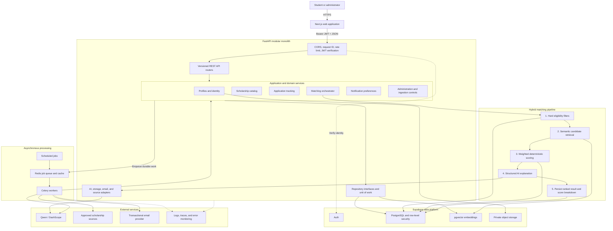
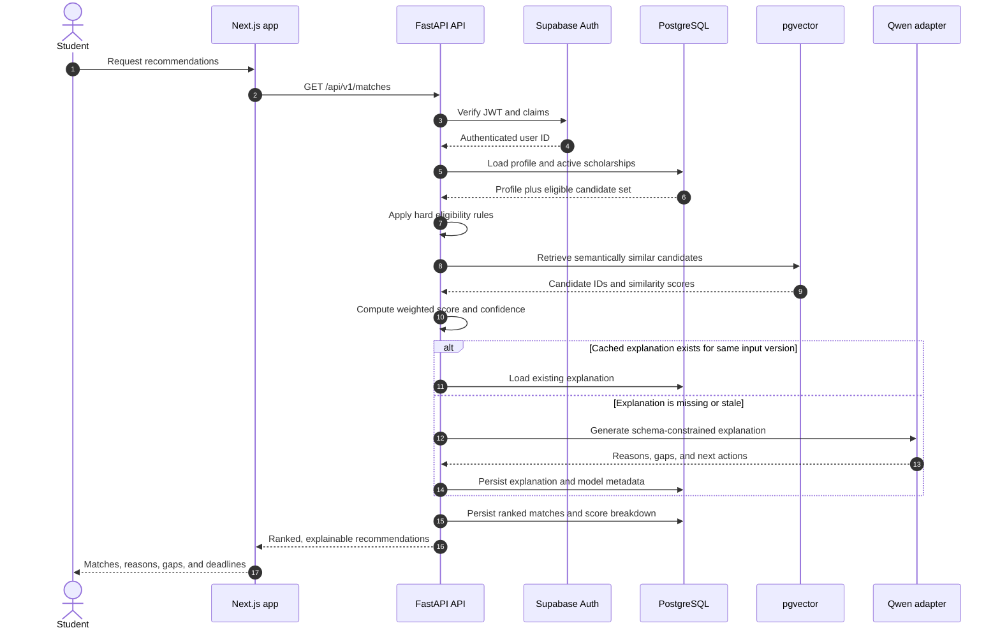
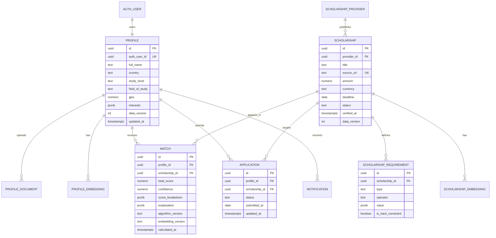

# ScholarMatch AI: Technology Stack and Backend Architecture

## 1. Purpose

ScholarMatch AI helps students discover scholarships for which they are both eligible and competitive. The platform should do more than keyword search: it should combine verified eligibility rules, semantic similarity, profile strength, and deadline awareness to produce transparent, useful recommendations.

This document separates the technology already present in the repository from the recommended production architecture. The backend should begin as a **modular monolith**: one deployable FastAPI application organized into clear business domains, supported by a separate background worker. This is simpler to operate than microservices at the current stage and preserves natural boundaries for future extraction.

### Architecture goals

- Return relevant scholarship recommendations without allowing AI to override hard eligibility rules.
- Explain why every scholarship was recommended and clearly identify missing information.
- Keep user data private through least-privilege access and row-level security.
- Support repeatable scholarship ingestion, normalization, deduplication, and expiry.
- Move slow AI, ingestion, and notification work out of request/response paths.
- Make matching decisions observable, versioned, and testable.

## 2. Technology stack

Status meanings:

- **Present**: represented in the current repository.
- **Planned**: recommended for implementation but not yet wired into the application.

| Layer | Technology | Status | Role and rationale |
| --- | --- | --- | --- |
| Web application | Next.js 16, React 19, TypeScript 5 | Present | App Router frontend with server rendering, typed UI code, and a mature deployment path. |
| Styling and UI | Tailwind CSS 4, Lucide React | Present | Consistent utility-first styling and accessible iconography. |
| Motion | Framer Motion, GSAP | Present | Use selectively for onboarding and high-value interaction feedback; avoid making core flows dependent on animation. |
| API | Python 3.12+, FastAPI, Uvicorn | FastAPI/Uvicorn present; Python version to pin | Async, OpenAPI-native HTTP API with strong validation and a good fit for AI/data workloads. |
| Validation and settings | Pydantic 2, `pydantic-settings` | Pydantic present; settings package must be added explicitly | Typed request/response contracts and environment-based configuration. |
| Primary data platform | Supabase PostgreSQL | Client/config present | Relational source of truth for profiles, scholarships, applications, matches, and audit records. |
| Authentication | Supabase Auth with JWT verification | Planned | Managed identity with backend JWT validation and authorization checks. |
| Authorization | PostgreSQL Row-Level Security plus backend role checks | Planned | Defense in depth: users can only access their own profile, matches, documents, and applications. |
| Vector search | `pgvector` in Supabase PostgreSQL | Planned | Keeps semantic scholarship search close to transactional data and avoids a second database during the MVP. |
| File storage | Supabase Storage | Planned | Private storage for transcripts, CVs, recommendation letters, and scholarship attachments using signed URLs. |
| AI generation | Qwen through Alibaba Cloud DashScope | Configuration present | Generates structured profile summaries and human-readable match explanations. It must not determine hard eligibility. |
| Embeddings | A single versioned embedding model behind an adapter | Planned | Produces comparable vectors for profiles and scholarships. Store model name and embedding version with every vector. |
| Background jobs | Celery with managed Redis | Planned | Durable execution for ingestion, document processing, embeddings, rematching, and deadline notifications. |
| Caching/rate limiting | Managed Redis | Planned | Short-lived match caching, idempotency keys, distributed rate limits, and worker brokering. |
| API integrations | HTTPX | Present | Async calls to AI and approved scholarship sources with explicit timeouts, retries, and circuit-breaking behavior. |
| Testing | Pytest, pytest-asyncio, HTTPX test client | Planned | Unit, contract, repository, and end-to-end API coverage. Matching fixtures should make scores reproducible. |
| Code quality | Ruff, mypy, pre-commit | Planned | Fast linting/formatting and static validation for boundary contracts. |
| Observability | Structured JSON logs, OpenTelemetry, Sentry | Logging scaffold present; remainder planned | Correlated traces, actionable error reporting, latency monitoring, and AI usage visibility. |
| Frontend hosting | Vercel | Planned | Natural deployment target for Next.js with preview environments. |
| API/worker hosting | Docker containers on a managed runtime | Planned | Run the API and worker from the same image with different commands; choose a region close to the Supabase project. |
| CI/CD | GitHub Actions | Planned | Run linting, type checks, tests, migrations, image builds, and staged deployments on protected branches. |

### Important dependency decisions

1. **PostgreSQL remains the source of truth.** Redis is disposable acceleration and job infrastructure, never the only home of user or match data.
2. **AI output is advisory and schema-constrained.** Qwen produces summaries and explanations, while deterministic application code enforces eligibility and computes the final score.
3. **One embedding model is used for both profiles and scholarships.** Changing models creates a new embedding version and triggers a controlled re-index.
4. **The API and worker share domain code.** They deploy separately but use the same service and repository implementations, avoiding duplicated business rules.

## 3. Proposed backend system architecture



### Why this shape

- **Routers stay thin.** They authenticate, validate, call one application service, and serialize the response.
- **Domain services own decisions.** Eligibility, scoring, application state transitions, and notification policy do not live in HTTP handlers or database queries.
- **Repositories isolate persistence.** Supabase/PostgreSQL access can change without rewriting matching rules.
- **Adapters isolate vendors.** Qwen, storage, email, and external scholarship sources are accessed through interfaces with timeouts and error handling.
- **Workers handle expensive or retryable work.** An API request should not wait for document extraction, bulk embeddings, source synchronization, or email delivery.

## 4. Hybrid matching design

A match is calculated in ordered stages. Later stages cannot restore a scholarship rejected by a verified hard constraint.



### Scoring model

Start with an explicit weighted model whose components are individually visible:

| Component | Example weight | Description |
| --- | ---: | --- |
| Academic fit | 30% | GPA, field of study, level of study, and academic requirements. |
| Eligibility fit | 25% | Nationality, residency, institution, demographic, and program constraints that are not binary exclusions. |
| Interest and goal similarity | 20% | Vector similarity between normalized profile goals and scholarship intent. |
| Experience fit | 15% | Leadership, community work, research, employment, or extracurricular requirements. |
| Readiness and timing | 10% | Profile completeness, document readiness, and time remaining before the deadline. |

Weights are configuration, not magic constants embedded across handlers. Persist the component scores, weight version, input-data version, embedding version, and explanation model metadata. This makes a recommendation reproducible and allows offline evaluation before changing the algorithm.

The initial candidate pipeline should be:

1. Exclude closed, unpublished, or unverified scholarships.
2. Apply confirmed binary requirements such as nationality, degree level, minimum GPA, and age where data is available.
3. Mark missing profile facts as **unknown**, not automatically ineligible.
4. Retrieve the most relevant remaining scholarships using filters plus vector similarity.
5. Calculate a deterministic weighted score and confidence based on profile completeness.
6. Ask Qwen only for a structured explanation of the supplied facts and score breakdown.
7. Validate the AI response against a Pydantic schema and reject unsupported claims.

## 5. Backend modules

The recommended Python package layout is:

```text
backend/app/
├── api/
│   ├── dependencies.py
│   └── v1/endpoints/
│       ├── profiles.py
│       ├── scholarships.py
│       ├── matches.py
│       ├── applications.py
│       └── admin.py
├── core/
│   ├── config.py
│   ├── security.py
│   ├── logging.py
│   └── exceptions.py
├── domain/
│   ├── profiles/
│   ├── scholarships/
│   ├── matching/
│   └── applications/
├── services/
│   ├── matching_service.py
│   ├── ingestion_service.py
│   └── notification_service.py
├── repositories/
│   ├── profiles.py
│   ├── scholarships.py
│   ├── matches.py
│   └── applications.py
├── integrations/
│   ├── qwen.py
│   ├── embeddings.py
│   ├── storage.py
│   └── email.py
├── workers/
│   ├── celery_app.py
│   └── tasks.py
├── schemas/
├── db/
└── main.py
```

This is a package boundary plan, not a requirement to create every file immediately. Add modules as vertical features are implemented, and avoid empty abstraction layers.

## 6. Core data model



Additional tables should cover provider/source history, ingestion runs, notification preferences, audit events, and idempotency keys. Raw imported content should be retained separately from normalized scholarship records so normalization can be rerun and audited.

## 7. API surface

The first stable API should expose resource-oriented endpoints under `/api/v1`:

| Domain | Initial endpoints |
| --- | --- |
| System | `GET /healthz`, `GET /readyz` |
| Profile | `GET /profile`, `PUT /profile`, `POST /profile/documents` |
| Scholarships | `GET /scholarships`, `GET /scholarships/{id}` |
| Matching | `GET /matches`, `POST /matches/recalculate`, `GET /matches/{scholarship_id}` |
| Applications | `GET /applications`, `POST /applications`, `PATCH /applications/{id}` |
| Administration | `POST /admin/ingestion-runs`, `GET /admin/ingestion-runs/{id}` |

Use cursor pagination for scholarship and match collections. Mutating endpoints should support idempotency keys where duplicate submissions would be harmful. Generate the OpenAPI schema in CI and use it to derive a typed frontend client.

## 8. Security and privacy

- Verify Supabase JWT signatures, issuer, audience, expiry, and subject on the backend; never trust a user ID supplied in a request body.
- Keep the Supabase service-role key and Qwen key on server-side runtimes only. The browser receives only the Supabase anonymous key.
- Enable RLS on every user-owned table and test policies as part of integration tests.
- Store uploaded documents in private buckets and issue short-lived signed URLs only after authorization.
- Redact secrets, tokens, document contents, and sensitive profile fields from logs and error reports.
- Apply file type/size validation and malware scanning before processing uploaded documents.
- Rate-limit authentication-sensitive, AI-backed, ingestion, and match-recalculation endpoints.
- Record administrative changes and scholarship verification actions in an append-only audit log.
- Define retention and deletion flows so account deletion removes or anonymizes derived embeddings, matches, documents, and notifications.

> **Repository security note:** The initial scaffold tracked `backend/app/.env`. It has been removed from version control; keep real values only in ignored local files and retain only the sanitized `.env.example`. Rotate any credential that was ever committed.

## 9. Reliability and observability

Every request and job should carry a correlation ID. Structured events should include route/task name, duration, result, retry count, and safe identifiers. Track at least:

- API latency, error rate, and saturation by endpoint.
- Queue depth, task age, retry rate, and dead-letter count.
- Qwen latency, validation failures, token usage, and cost.
- Match pipeline candidate counts after each stage.
- Scholarship freshness, ingestion failures, duplicates, and expired records.
- Notification delivery and bounce rates.

AI and external-source calls require explicit connect/read timeouts, bounded retries with jitter, and circuit breakers. A failed explanation should not discard a valid deterministic match; return the score with an explanation status and retry asynchronously.

## 10. Delivery plan

### Phase 0 — Make the scaffold runnable

- Correct the backend package layout and configuration import/typing errors.
- Pin the Python runtime and separate direct dependencies from generated lock data.
- Add local startup commands, Docker configuration, and health/readiness checks.
- Remove the tracked `.env`, sanitize examples, and rotate exposed credentials.

### Phase 1 — Secure vertical foundation

- Create Supabase migrations for profiles, scholarships, requirements, and providers.
- Implement JWT verification, RLS policies, repository interfaces, and profile endpoints.
- Add unit and API integration tests in CI.

### Phase 2 — Scholarship catalog and ingestion

- Build administrator-managed scholarship CRUD and verification workflows.
- Add an idempotent ingestion pipeline: fetch, preserve raw data, normalize, deduplicate, validate, and publish.
- Schedule expiry and freshness checks through the worker tier.

### Phase 3 — Matching MVP

- Implement hard eligibility rules and a versioned weighted score.
- Add embeddings and pgvector candidate retrieval.
- Persist score breakdowns and expose ranked match endpoints.
- Evaluate precision with a curated set of representative student profiles and scholarships.

### Phase 4 — Explainability and application tracking

- Add schema-constrained Qwen explanations grounded only in supplied match facts.
- Implement saved scholarships, application state transitions, deadline reminders, and document readiness.
- Capture explicit user feedback to improve ranking evaluation without silently training on private data.

### Phase 5 — Production hardening

- Add Redis-backed rate limits, durable retries, dead-letter handling, tracing, dashboards, backups, and restore drills.
- Load-test catalog search, matching, and batch re-indexing.
- Document incident response, data retention, model/version rollback, and provider failure procedures.

## 11. Evolution path

Keep the modular monolith until real measurements show a scaling or ownership constraint. The first likely extraction candidates are:

1. **Ingestion workers**, when source-specific processing grows independently.
2. **Matching workers**, when re-indexing or batch recommendation workloads compete with API traffic.
3. **Notification delivery**, when multiple channels and high-volume scheduling require separate scaling.

Extraction should preserve the same domain contracts and use durable events. Do not introduce microservices, a separate vector database, or event streaming solely in anticipation of scale.
